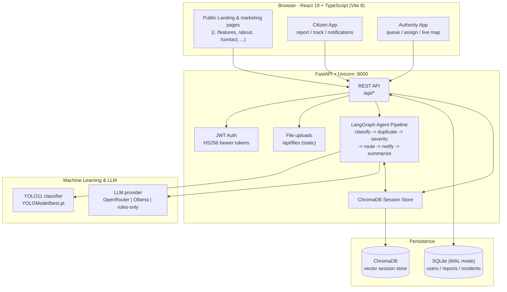
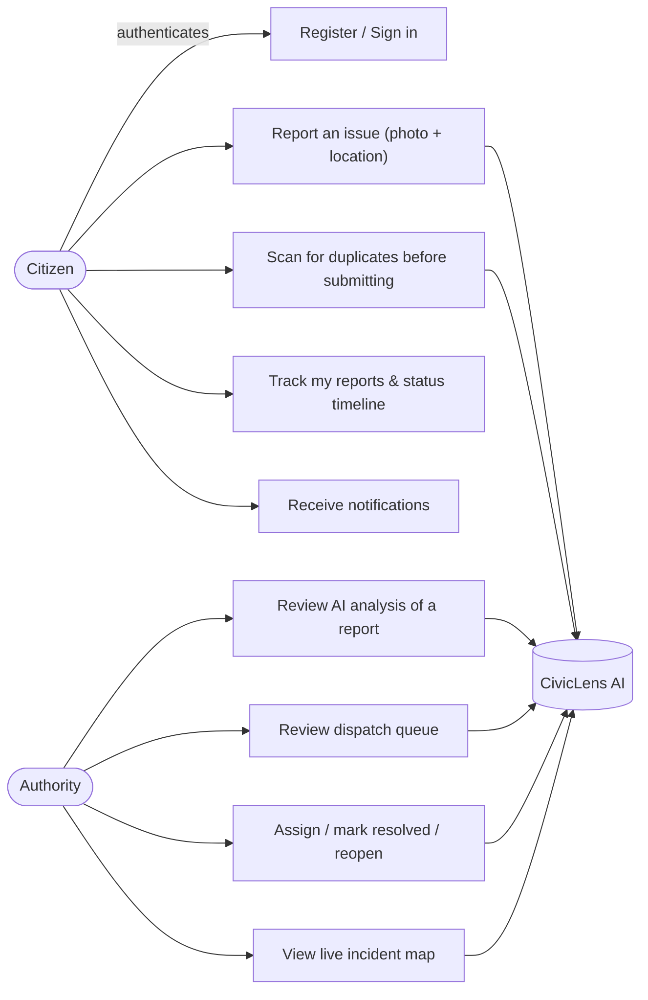
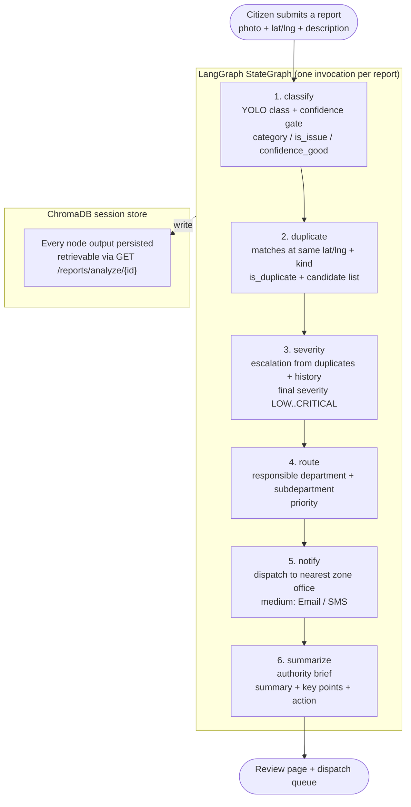

# CivicLens AI

A civic issue-reporting web app that lets citizens report street problems (potholes, broken streetlights, illegal dumping, waterlogging, etc.) and lets municipal authorities review, assign, and track fixes on a live map and dispatch queue. An **AI agent pipeline** classifies, de-duplicates, scores severity, routes, notifies, and summarizes every report automatically.

The demo is seeded with real-world incidents across **Ahmedabad, Gujarat (India)** — map, report form, and queue all default to that city.

---

## Table of Contents

<details>
<summary>Show full table of contents</summary>

- [System Diagrams](#system-diagrams)
  - [Architecture](#architecture)
  - [Use Case Diagram](#use-case-diagram)
  - [Agentic Workflow](#agentic-workflow)
- [Features](#features)
- [Tech Stack](#tech-stack)
- [Project Structure](#project-structure)
- [Getting Started](#getting-started)
  - [Backend Setup](#backend-setup)
  - [Frontend Setup](#frontend-setup)
- [Demo Accounts](#demo-accounts)
- [Frontend Routes](#frontend-routes)
- [API Reference](#api-reference)
- [Agent Pipeline Deep Dive](#agent-pipeline-deep-dive)
- [Environment Variables](#environment-variables)
- [Data Model](#data-model)
- [Scripts](#scripts)
- [Notes](#notes)
- [Troubleshooting](#troubleshooting)

</details>

---

## System Diagrams

### Architecture



### Use Case Diagram



### Agentic Workflow



Every node falls back to **deterministic rules** when the LLM is unavailable or a structured call fails, so the pipeline never breaks (`OpenRouter -> Ollama -> rules`).

---

## Features

- **Public landing + marketing pages** — hero with auto-playing demo video, 5-step workflow, `SaaSFooter` with linked Features / Solution / Mobile App / About / Privacy / Contact pages.
- **Citizen reports** — create a report with category, description, address, map pin, and photo.
- **AI-style review** — duplicate detection panel and AI assessment summary before submission.
- **Duplicate scan** — when a photo is uploaded, the backend scans open issues at the pinned location and flags exact-location duplicates; the review step shows a duplicate alert and community severity votes.
- **LangGraph agent pipeline** — `classify → duplicate → severity → route → notify → summarize` agents produce structured outputs (YOLO classification + confidence gate, location/category duplication check, severity escalation, department routing, zone-office dispatch, and an authority summary). Every step is persisted to a ChromaDB session store; the review page shows the routed department and summary.
- **Live incident map** — seeded incidents shown as pins; map auto-fits to the incident bounds.
- **Authority dispatch queue** — Pending / Assigned / Resolved tabs driven by live backend data; Assign, Mark Resolved, and Reopen actions persist to the backend and update the map immediately.
- **My Reports** — track status and timeline of your submitted reports.
- **Notifications** — in-app notifications on key events.
- **Roles** — Citizen and Authority accounts with route protection.

---

## Tech Stack

<details>
<summary>Show frontend stack</summary>

| Layer            | Technology                                             |
| ---------------- | ------------------------------------------------------ |
| Framework        | React 19 + TypeScript                                  |
| Build tool       | Vite 8                                                 |
| Routing          | React Router 7 (HashRouter)                            |
| Styling          | Tailwind CSS 4 (design tokens + utilities)             |
| UI components    | `component-labs` (SaaSFooter), Material Symbols icons  |
| Animation        | `motion` (framer-motion) for scroll reveals            |
| Maps             | Leaflet (interactive incident + location maps)         |
| Reverse geocoding| Nominatim (OpenStreetMap)                              |
| Map tiles        | CARTO Positron (light) via `src/constants/map.ts`      |
| State            | React Context + a small `useSyncExternalStore` store   |

</details>

<details>
<summary>Show backend stack</summary>

| Layer            | Technology                                               |
| ---------------- | -------------------------------------------------------- |
| Framework        | FastAPI (Python)                                         |
| Server           | Uvicorn                                                  |
| Database         | SQLite (via `sqlite3`, WAL mode)                         |
| Auth             | JWT (PyJWT, HS256), HTTP Bearer                          |
| Validation       | Pydantic                                                 |
| File uploads     | `python-multipart`, served from `/api/files`             |
| Agents           | LangGraph (StateGraph pipeline) + LangChain tools        |
| Vision model     | YOLO11 classification model (`YOLOModel/best.pt`)        |
| LLM              | OpenRouter free models (default `openai/gpt-oss-20b:free`) or local Ollama |
| Session store    | ChromaDB (persistent, hash-based embeddings)             |

</details>

---

## Project Structure

<details>
<summary>Show full project tree</summary>

```
civic/
├── backend/                    # FastAPI application
│   ├── main.py                 # App entrypoint, lifespan (init + seed), /api/health
│   ├── routers.py              # API routes (auth, reports, incidents, uploads, agents)
│   ├── database.py             # SQLite schema, seeding, queries, duplicate/history lookup
│   ├── schemas.py              # Pydantic request/response models
│   ├── auth.py                 # Password hashing + JWT helpers
│   ├── config.py               # Env config (JWT secret, LLM, admin credentials)
│   ├── detection.py            # YOLO11 image classification (+ confidence downgrade)
│   ├── requirements.txt
│   ├── .env / .env.example
│   ├── uploads/                # Uploaded report images (runtime)
│   ├── chroma/                 # ChromaDB persistence (runtime)
│   ├── civiclens.db            # SQLite database (runtime)
│   └── agents/                 # LangGraph agent pipeline
│       ├── graph.py            # StateGraph: classify → duplicate → severity → route → notify → summarize
│       ├── state.py            # Structured-output schemas + PipelineState (TypedDict)
│       ├── llm.py              # Provider factory (OpenRouter/Ollama) + structured invoke
│       ├── tools.py            # LangChain tools (duplicates, departments, nearby authorities, session)
│       ├── session_store.py    # ChromaDB session persistence
│       ├── classification.py   # Classification agent (YOLO + confidence gate)
│       ├── duplication.py      # Duplication agent (lat/lng + class + location)
│       ├── severity.py         # Severity agent (escalation from duplicates + history)
│       ├── router.py           # Router agent (responsible department)
│       ├── notify.py           # Notify agent (dispatch to nearest zone office)
│       └── summary.py          # Summary agent (authority brief)
├── YOLOModel/                  # Fine-tuned YOLO11 weights (best.pt)
├── src/                        # React frontend
│   ├── api/                    # API client + Nominatim geocoding
│   ├── components/
│   │   ├── landing/            # LandingHeader, LandingHero, WorkflowSection, LandingFooter, PageShell, InfoPage
│   │   ├── auth/               # TextField, RoleOption, CountryCodeSelect
│   │   ├── home/               # HeroSection, ActiveReportCard, CommunityFixList
│   │   ├── report/             # PhotoUpload, CategorySection, LocationSection, DuplicateDetectionPanel
│   │   ├── reports/            # ReportTimeline
│   │   ├── review/             # AgentAnalysis, AiAssessment, DuplicateAlert, SeverityVotes, ReviewActionBar
│   │   ├── dashboard/          # ReportQueueCard, IncidentMap, AssignDialog, ProcessingStatus
│   │   ├── BottomNav.tsx       # Mobile bottom navigation
│   │   ├── TopAppBar.tsx       # App bar with role-aware home link
│   │   ├── Icon.tsx            # Material Symbols wrapper
│   │   ├── RequireAuth.tsx     # Route guard (role-based)
│   │   └── StatusChip.tsx
│   ├── constants/              # navigation.ts, map.ts (tile URL)
│   ├── context/                # AuthContext, ReportsContext, NotificationsContext
│   ├── data/                   # mockData.ts, countryCodes.ts
│   ├── hooks/                  # useReportForm, useLoginForm, useDuplicateScan, useAgentPipeline,
│   │                           # useIncidents, useQueue, useReveal
│   ├── pages/                  # Landing, Features, Platform, MobileApp, About, Privacy, Contact,
│   │                           # Home, Report, AgentProcessing, Review, Dashboard, Login, Profile,
│   │                           # MyReports, Notifications, ActivityMap
│   ├── types/                  # report.ts, component-labs.d.ts
│   ├── utils/                  # detection.ts, severity.ts, time.ts
│   └── App.tsx                 # Route definitions
├── public/                     # favicon, icons.svg, landing-demo.mp4
├── scripts/validate.js         # Component validation (props interface + no hardcoded hex)
├── index.html
├── vite.config.ts              # React + Tailwind plugins, /api proxy → :8000
├── package.json
└── README.md
```

</details>

---

## Getting Started

### Backend Setup

<details>
<summary>Show backend setup steps</summary>

```bash
cd backend
python -m venv .venv

# Windows:
.\.venv\Scripts\activate
# macOS/Linux:
# source .venv/bin/activate

pip install -r requirements.txt
```

Optional: copy `.env.example` to `.env` and set a JWT secret.

Run the API (defaults to `http://127.0.0.1:8000`):

```bash
python -m uvicorn main:app --port 8000 --host 127.0.0.1
```

On startup the backend initializes the SQLite DB, re-seeds the demo incidents, and creates the demo authority account.

#### LLM Provider Options

<details>
<summary>Option A — OpenRouter (default, free tier)</summary>

The LangGraph agent pipeline runs on **OpenRouter free models** by default (needs a free API key from [openrouter.ai](https://openrouter.ai/keys)):

```bash
# backend/.env
CIVICLENS_LLM_PROVIDER=openrouter
CIVICLENS_OPENROUTER_API_KEY=sk-or-v1-...
CIVICLENS_OPENROUTER_MODEL=openai/gpt-oss-20b:free
```

</details>

<details>
<summary>Option B — Ollama (fully local, no API key)</summary>

Prefer a fully local setup? Switch the provider to **Ollama** (no API key needed):

```bash
ollama pull qwen2.5:3b
```

```ini
# backend/.env
CIVICLENS_LLM_PROVIDER=ollama
CIVICLENS_OLLAMA_MODEL=qwen2.5:3b
CIVICLENS_OLLAMA_BASE_URL=http://localhost:11434
```

</details>

<details>
<summary>Option C — No LLM (deterministic rules only)</summary>

Set `CIVICLENS_LLM_PROVIDER=none` to disable the LLM entirely — agents use deterministic rules only. The backend falls back gracefully: **OpenRouter → Ollama → rules**, so the pipeline works without any LLM.

</details>

</details>

### Frontend Setup

<details>
<summary>Show frontend setup steps</summary>

From the project root:

```bash
npm install
npm run dev
```

Open `http://localhost:5173` (Vite proxies `/api` to the backend on port 8000).

</details>

---

## Demo Accounts

| Role      | User ID / Identifier | Password     |
| --------- | -------------------- | ------------ |
| Authority | `admin`              | `civic2026`  |
| Citizen   | Create one at sign-in | any password (≥ 6 chars) |

Citizen accounts are created through the app's registration form (choose a user ID, password, and phone number). The country code field is an editable input with a dropdown of preset codes.

---

## Frontend Routes

| Route             | Description                                    | Auth       |
| ----------------- | ---------------------------------------------- | ---------- |
| `/`               | Public landing page (auto-playing demo video)  | Public     |
| `/features`       | Platform features                              | Public     |
| `/platform`       | Solution / workflow overview                   | Public     |
| `/mobile-app`     | Mobile app page                                | Public     |
| `/about`          | About CivicLens AI                             | Public     |
| `/privacy`        | Privacy policy                                 | Public     |
| `/contact`        | Contact / sales / support                      | Public     |
| `/login`          | Sign in / register / reset password            | Public     |
| `/home`           | Citizen home dashboard                         | Citizen    |
| `/report`         | New civic issue report                         | Any user   |
| `/report/agents`  | AI agent processing animation                  | Any user   |
| `/report/review`  | Review report + AI analysis                    | Any user   |
| `/reports`        | My reports & status timeline                   | Citizen    |
| `/profile`        | Profile & links                                | Any user   |
| `/notifications`  | In-app notifications                           | Any user   |
| `/activity-map`   | Live incident map                              | Any user   |
| `/admin`          | Authority dispatch queue                       | Authority  |

---

## API Reference

Base URL: `http://127.0.0.1:8000/api`

<details>
<summary>Show full API table</summary>

| Method | Endpoint               | Description                                    | Auth   |
| ------ | ---------------------- | ---------------------------------------------- | ------ |
| GET    | `/health`              | Service health check                           | Public |
| POST   | `/auth/register`       | Create a citizen account (returns JWT)         | Public |
| POST   | `/auth/login`          | Sign in (returns JWT)                          | Public |
| GET    | `/auth/me`             | Current user from bearer token                 | Bearer |
| POST   | `/auth/reset-password` | Reset a citizen password                       | Public |
| POST   | `/reports`             | Create a report                                | Bearer |
| GET    | `/reports`             | List reports (citizen: own; authority: all)    | Bearer |
| GET    | `/reports/duplicates`  | Scan for open issues at a location (lat, lng)  | Bearer |
| POST   | `/reports/analyze`     | Run the agent pipeline (multipart)             | Bearer |
| GET    | `/reports/analyze/{id}`| Retrieve stored agent steps for a session      | Bearer |
| GET    | `/incidents`           | List live incidents (map + queue)              | Bearer |
| PATCH  | `/incidents/{id}`      | Update an incident's status                    | Bearer |
| POST   | `/upload`              | Upload an image, returns a public URL          | Bearer |

</details>

<details>
<summary>Agent pipeline analyze request</summary>

`POST /reports/analyze` accepts `multipart/form-data`:

| Field       | Type   | Notes                                        |
| ----------- | ------ | -------------------------------------------- |
| `file`      | binary | Uploaded evidence image (jpeg/png/webp/gif, ≤ 5 MB) |
| `image_url` | string | Alternative to `file`                         |
| `lat`       | float  | Report latitude                              |
| `lng`       | float  | Report longitude                             |
| `category`  | string | Chosen category                              |
| `location`  | string | Address / location label                     |
| `description` | string | Report description                        |

The endpoint returns the persisted session with all six agent outputs, retrievable again later via `GET /reports/analyze/{id}`.

</details>

---

## Agent Pipeline Deep Dive

<details>
<summary>Show agent pipeline details</summary>

The pipeline is a compiled LangGraph `StateGraph` defined in `backend/agents/graph.py`. Each node:

1. Reads its inputs from the shared `PipelineState`.
2. Calls a grounded LangChain tool first (duplicates, departments, nearby authorities, session context).
3. Asks the LLM for a structured (Pydantic) verdict via `structured_invoke`.
4. Falls back to deterministic rules if the LLM is unavailable or the structured call fails.
5. Writes its output to both the graph state **and** the ChromaDB session store.

| Step       | Inputs                                   | Output (`backend/agents/state.py`)                       |
| ---------- | ---------------------------------------- | -------------------------------------------------------- |
| classify   | image bytes                              | `ClassificationResult` — category, label, confidence, severity, is_issue, confidence_good, reasoning |
| duplicate  | lat/lng, category                        | `DuplicationResult` — is_duplicate, candidate `DuplicateMatch[]`, reasoning |
| severity   | classification + duplication + history   | `SeverityResult` — final severity, base severity, escalation %, duplicate_count, history_count, reasoning |
| route      | category, location                       | `RouterResult` — department, subdepartment, priority, reasoning |
| notify     | routed department + lat/lng              | `NotifyResult` — primary authority, zone office, medium (Email/SMS), status, nearby offices |
| summarize  | persisted session context                | `SummaryResult` — summary, key_points, recommended_action |

Department routing rules and nearby-authority lookup live in `backend/agents/tools.py`; the ChromaDB layer is in `backend/agents/session_store.py`.

</details>

---

## Environment Variables

<details>
<summary>Show all environment variables</summary>

All variables are read from `backend/.env` (see `.env.example`). Defaults shown in parentheses.

| Variable                          | Default                          | Description                                       |
| --------------------------------- | -------------------------------- | ------------------------------------------------- |
| `CIVICLENS_JWT_SECRET`            | `dev-secret-change-me-in-production` | JWT signing secret (set a strong value in prod) |
| `CIVICLENS_LLM_PROVIDER`          | `openrouter`                     | `openrouter` \| `ollama` \| `none`                |
| `CIVICLENS_OPENROUTER_API_KEY`    | *(empty)*                        | OpenRouter API key (free tier supported)          |
| `CIVICLENS_OPENROUTER_BASE_URL`   | `https://openrouter.ai/api/v1`   | OpenRouter base URL                               |
| `CIVICLENS_OPENROUTER_MODEL`      | `openai/gpt-oss-20b:free`        | OpenRouter model id                               |
| `CIVICLENS_OLLAMA_BASE_URL`       | `http://localhost:11434`         | Ollama server URL                                 |
| `CIVICLENS_OLLAMA_MODEL`          | `qwen2.5:3b`                     | Ollama model name                                 |
| `CIVICLENS_CONFIDENCE_THRESHOLD`  | `0.60`                           | YOLO confidence above which a detection is reliable |

</details>

---

## Data Model

<details>
<summary>Show database schema and status flow</summary>

### Tables

| Table      | Columns                                                                              |
| ---------- | ------------------------------------------------------------------------------------ |
| `users`    | `id`, `email` (unique), `username` (unique), `role`, `password_hash`, `phone` (unique), `created_at` |
| `reports`  | `id`, `title`, `category`, `description`, `address`, `lat`, `lng`, `image_url`, `status`, `reporter_email`, `created_at`, `events` (JSON timeline) |
| `incidents`| `id`, `title`, `category`, `description`, `status`, `severity`, `image_url`, `lat`, `lng`, `updated_at` |

### Status flow

- Seed incidents use **Open / In Progress / Resolved**.
- The dispatch queue normalizes these to **pending / in_progress / resolved** (`database._normalize_queue_status`).
- Citizen reports append every status change to their `events` JSON timeline, which powers the "My Reports" timeline view.

### Duplicate & history lookup

- `find_duplicate_issues(lat, lng, radius_m=25)` — open incidents + pending citizen reports within street-level tolerance (25 m).
- `lookup_history(lat, lng, radius_m=200)` — total / open / resolved / recent-30d counts plus average severity rank, used by the severity agent for escalation.

</details>

---

## Scripts

| Command                | Description                               |
| ---------------------- | ----------------------------------------- |
| `npm run dev`          | Start the Vite dev server                 |
| `npm run build`        | Type-check and build for production       |
| `npm run preview`      | Preview the production build              |
| `npm run typecheck`    | Run `tsc --noEmit`                        |
| `npm run validate`     | Run the custom validation script          |

---

## Notes

- Seed data lives in `backend/database.py`; edit `SEED_INCIDENTS` / `SEED_INCIDENT_IMAGES` there.
- Map tile provider is centralized in `src/constants/map.ts` (used by both the dashboard map and the report location picker).
- `REPORT` images and uploads are stored under `backend/uploads/`.
- The agent pipeline (`backend/agents/`) is a LangGraph `StateGraph`. Each node writes its structured output (Pydantic) both to the graph state and to the ChromaDB session store under `backend/chroma/`. If the LLM is unavailable or a structured call fails, every agent falls back to deterministic rules so the flow never breaks.
- Department routes are defined in `backend/agents/tools.py` (`DEPARTMENT_ROUTES`).
- The YOLO model is optional: if `YOLOModel/best.pt` or `ultralytics` is missing, image detection is skipped gracefully (`detect_image` returns `None`).
- The public landing page auto-plays `public/landing-demo.mp4` in the hero and includes a `component-labs` `SaaSFooter`; footer links are rewired to app routes in `src/components/landing/LandingFooter.tsx`.

---

## Troubleshooting

<details>
<summary>Show common issues and fixes</summary>

| Problem                                          | Fix                                                                                   |
| ------------------------------------------------ | ------------------------------------------------------------------------------------- |
| Map tiles / reverse geocoding don't load         | Check internet access; Nominatim and CARTO tiles are remote services.                 |
| `POST /reports/analyze` returns 422              | The YOLO weights may be missing — this is fine; agents fall back to rules.            |
| Agents return rule-based output instead of LLM   | No OpenRouter key set, or Ollama not running. Check `CIVICLENS_LLM_PROVIDER`.         |
| Port 8000 already in use                         | Change the port with `--port`, and update the proxy in `vite.config.ts` if needed.    |
| Reports/incidents look stale after changes       | Stop and restart the backend — incidents are re-seeded on startup.                    |
| Frontend API calls fail (proxy)                  | Ensure the backend runs on `127.0.0.1:8000`; Vite proxies `/api` to it.               |
| `npm run validate` fails on a new component      | Add an `interface XxxProps` (ending in `Props`) and avoid hardcoded hex colors in `className`. |

</details>
